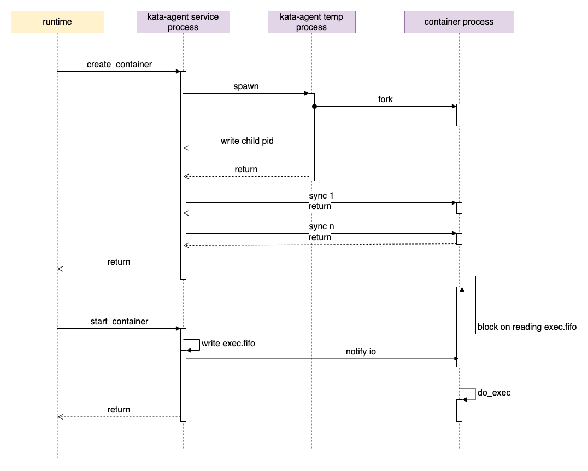
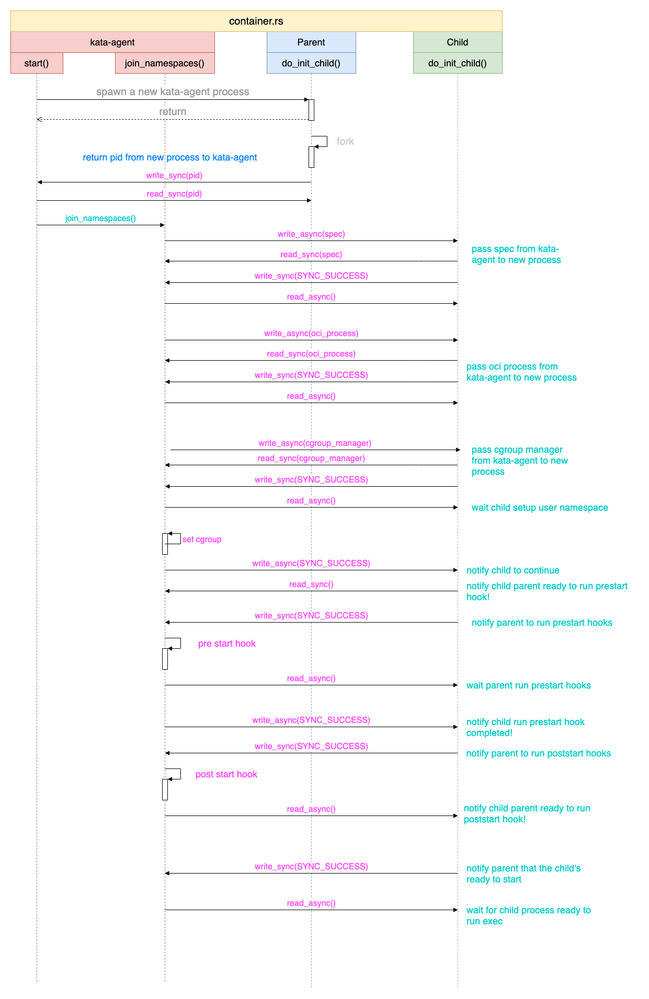

# agent 代码解析

agent 可以作为 guest init 进程启动，也可以使用 systemd 等作为 init ，agent 作为普通进程启动。在这篇文的中，我们以将 agent 作为普通服务/进程启动，使用 systemd 作为 init 系统为例进行说明。

agent 项目又分为如下几个 crate：

- agent：代码位置 src/agent，即 agent 代码的根。
- rustjail： 类似 golang 中的 libcontainer 的角色。代码位置 src/agent/rustjail
- protocols：主要定义了 runtim <-> agent 之间的通信协议。代码位置 src/agent/protocols
- oci：主要是定义了 OCI 相关 spec 的数据结构。代码位置 src/agent/oci

## agent 进程

agent 的启动代码见 main.rs 的 main 函数即可。

agent 程序有两个作用：

- ttrpc服务：作为 agent 服务，通过 ttrpc 响应来自 shim 进程的请求
- 启动容器：启动容器时，agent 会通过运行 agent 二进制在新的进程中启动容器

### 启动 ttrpc 服务

main 函数会判断命令行参数，如果第一个参数是 init，表示是要启动一个新的容器；否则表示要启动 ttrpc 服务：

```rust
fn main() -> std::result::Result<(), Box<dyn std::error::Error>> {
    let args: Vec<String> = env::args().collect();

    // 如果是 kata-agent init，则准备进入创建容器的步骤
    if args.len() == 2 && args[1] == "init" {
        rustjail::container::init_child();
        exit(0);
    }

    let rt = tokio::runtime::Builder::new_multi_thread()
        .enable_all()
        .build()?;

    // 在 real_main 里启动 ttrpc 服务。
    rt.block_on(real_main())
}
```

我们可以看到， 启动 agent 服务代码在 `real_main` 函数中。

TODO

### 启动容器流程

这里我们来看一下创建并启动一个容器的流程。

启动一个容器包括两个 rpc call：

- create_container
- start_container

这两个 rpc call 的入口都在 rpc.rs 中，而实际工作代码，都是在 do_create_container 和 do_start_container 这两个函数中实现的。

#### create_container/do_create_container

`do_create_container` 中主要有如下操作：

- rescan_pci_bus：查找新设备
- add_devices：更新设备列表，让 OCI spec 中的配置和 guest 中的设备同步
- add_storages： mount 设备/volume
- update_container_namespaces：更新 OCI spec 中的 namspace
- update_device_cgroup：更新 device cgroup
- append_guest_hooks
- setup_bundle：创建、设置容器的 bundle 目录，创建 config.json 文件。

在上面这些准备工作完成之后，下面的代码会创建容器：

```rust

let mut ctr: LinuxContainer =
    LinuxContainer::new(cid.as_str(), CONTAINER_BASE, opts, &sl!())?;

let p = if oci.process.is_some() {
    Process::new(
        &sl!(),
        &oci.process.as_ref().unwrap(),
        cid.as_str(),
        true,
        pipe_size,
    )?
} else {
    return Err(anyhow!(nix::Error::from_errno(nix::errno::Errno::EINVAL)));
};

ctr.start(p).await?;

```

也即创建一个 `LinuxContainer` 类型的结构 `ctr` ，为 `ctr` 设置 `Process` 属性，也就是容器要运行的进程，然后调用 `ctr.start(p)` 来“启动”容器。这里虽然使用了 `start` 作为函数名，实际上容器的进程还没有真正的启动。在介绍容器真正启动代码之前，我们先来看看 `ctr.start(p)` 方法都干了什么。


#### ctr.start(p)

这里 ctr 是一个 `LinuxContainer` 类型的结构体，也是 Kata agent 中容器的实现，`p` 为一个进程，也就是容器的进程。 

agent 创建容器进程的时候，会先启动 `kata-agent` 进程：

```rust
let exec_path = std::env::current_exe()?;
let mut child = std::process::Command::new(exec_path);
let mut child = child
    .arg("init")
    .stdin(child_stdin)
    .stdout(child_stdout)
    .stderr(child_stderr)
    .env(INIT, format!("{}", p.init))
    .env(NO_PIVOT, format!("{}", self.config.no_pivot_root))
    .env(CRFD_FD, format!("{}", crfd))
    .env(CWFD_FD, format!("{}", cwfd))
    .env(CLOG_FD, format!("{}", cfd_log));

if p.init {
    child = child.env(FIFO_FD, format!("{}", fifofd));
}

child.spawn()?;

```

这个进程就是 Kata agent 进程本身，设置了 `init` 参数，这样 agent 启动的时候会去创建容器进程。其余 CRFD_FD/CWFD_FD 用于父（agent）子（容器）进程之间同步。

上面代码有两点需要说明一下：

- `p.init`： Process 的 init 属性，如果是 true，表示启动的是容器的进程，如果是 false 表示是 exec RPC 启动的普通进程，这两种进程处理有区别。
- FIFO_FD 是容器 bundle 下的一个名为 `exec.fifo` 的文件，这个文件用于控制容器进程的启动。

这样“容器进程”就启动了，下面就是获取容器进程的 pid：

```rust
let pid_buf = read_async(&mut pipe_r).await?;
let pid_str = std::str::from_utf8(&pid_buf).context("get pid string")?;
let pid = match pid_str.parse::<i32>() {
    Ok(i) => i,
    Err(e) => {
    }
};
```

可以看出，这个 pid 不是通过函数调用直接得到的，而是通过 `pipe_r` 读出来的。

```rust
let (prfd, cwfd) = unistd::pipe().context("failed to create pipe")?;
let (crfd, pwfd) = unistd::pipe().context("failed to create pipe")?;

let mut pipe_r = PipeStream::from_fd(prfd);
let mut pipe_w = PipeStream::from_fd(pwfd);
```

这个 `pipe_r` 的另一端，就是传递给容器进程的 `cwfd`。在容器进程启动的时候，也是经过了一次 fork 操作在子进程中运行容器进程。


`ctr.start()` 最后执行的一个比较重要的函数就是 `join_namespaces` 了，在这个函数中，会创建、启动真正容器进程。而真正的进程管理工作，则是在新启动的子 kata-agent 进程中实现的。也就是下面要介绍的 do_init_child 函数。

#### do_init_child

do_init_child 是 kata-agent 进程启动后，创建真正容器进程的处理函数。do_init_child 和 kata-agent 进程通过 cwfd/crfd 这对分别用于写入和读取的 fd 来通信（同步）。 

```rust
// kata-containers/src/agent/rustjail/src/container.rs

fn do_init_child(cwfd: RawFd) -> Result<()> {
    match fork() {
        Ok(ForkResult::Parent { child, .. }) => {
            let _ = write_sync(cwfd, SYNC_DATA, format!("{}", pid_t::from(child)).as_str());
            // parent return
            return Ok(());
        }
        Ok(ForkResult::Child) => (),
        Err(e) => {
        }
    }

}
```

我们可以看到，kata-agent 带 init 参数启动后，会 fork 一次，创建的子进程才是容器进程真正执行的进程（实际也是通过 `execvp` 启动的）。fork 成功时，父进程会把子进程的 pid 写到 cwfd 中，这样 kata-agent 进程就获得了容器的真实 pid 。

主 kata-agent 进程的 `join_namespaces` 函数和新创建的 kata-agent 子进程通过文件句柄来同步容器的创建过程，比如让父进程发送容器 spec 给子进程，子进程通知父进程执行 hook 等。

`do_init_child` 函数最后部分代码如下：

```rust

if init {
    if init {
        fifofd = std::env::var(FIFO_FD)?.parse::<i32>().unwrap();
    }

    ... ...

    let fd = fcntl::open(
        format!("/proc/self/fd/{}", fifofd).as_str(),
        OFlag::O_RDONLY | OFlag::O_CLOEXEC,
        Mode::from_bits_truncate(0),
    )?;
    unistd::close(fifofd)?;
    let mut buf: &mut [u8] = &mut [0];
    unistd::read(fd, &mut buf)?;
}

do_exec(&args);

```

我们看到，如果启动的时候带有 init 参数，也就是容器进程，则会去读取 `exec.fifo` 文件。

这时候，kata-agent 子进程会 block 住，容器进程还没有真正启动。
直到下一个 rpc start_container 请求过来。

#### start_container/do_start_container

start_container 最终会执行到这个函数：


```rust
// kata-containers/src/agent/rustjail/src/container.rs
fn exec(&mut self) -> Result<()> {
    let fifo = format!("{}/{}", &self.root, EXEC_FIFO_FILENAME);
    let fd = fcntl::open(fifo.as_str(), OFlag::O_WRONLY, Mode::from_bits_truncate(0))?;
    let data: &[u8] = &[0];
    unistd::write(fd, &data)?;
    info!(self.logger, "container started");
    self.init_process_start_time = SystemTime::now()
        .duration_since(SystemTime::UNIX_EPOCH)
        .unwrap()
        .as_secs();

    self.status.transition(ContainerState::RUNNING);
    unistd::close(fd)?;

    Ok(())
}
```

我们可以看到，exec 函数不复杂，核心逻辑是往 `exec.fifo` 文件里写了点数据而已。这时，我们在上面看到的 `do_init_child` 函数中 block 在读取 `exec.fifo` 的地方就会继续执行，然后执行后面的 `do_exec` 方法：

```rust

fn do_exec(args: &[String]) -> ! {
    let path = &args[0];
    let p = CString::new(path.to_string()).unwrap();
    let sa: Vec<CString> = args
        .iter()
        .map(|s| CString::new(s.to_string()).unwrap_or_default())
        .collect();
    let a: Vec<&CStr> = sa.iter().map(|s| s.as_c_str()).collect();

    let _ = unistd::execvp(p.as_c_str(), a.as_slice()).map_err(|e| match e {
        nix::Error::Sys(errno) => {
            std::process::exit(errno as i32);
        }
        _ => std::process::exit(-2),
    });

    unreachable!()
}
```

我们可以看到，这里才真正通过 `execvp` 系统调用启动了容器中指定的进程。

### 启动容器小结

通过上面的分析，我们看到启动一个容器的流程大致如下图所示（这里并非是函数的调用关系，而是进程之间的关系）：



总结来说就是：

- create_container
  - kata-agent service 运行 `kata-agent init` 启动容器临时进程
  - 容器临时进程 fork()，父进程退出，将子进程的 pid 写回给 kata-agent service 进程
  - 容器临时进程子进程准备容器运行环境，block 在读取 `exec.fifo` 上
- start_container
  - kata-agent service 向容器的 `exec.fifo` 文件中写入数据
  - 容器临时进程子进程继续执行，通过 execvp 启动容器的真实进程

子进程和 kata-agent 之间的数据同步也是理解 agent 代码的关键，两个进程间通过（管道）文件句柄来互相同步，比如让父进程执行hook等操作。下面的图是两者之间主要的同步内容和流程：


