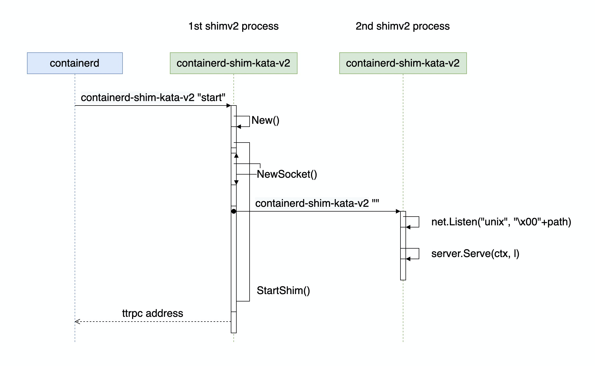
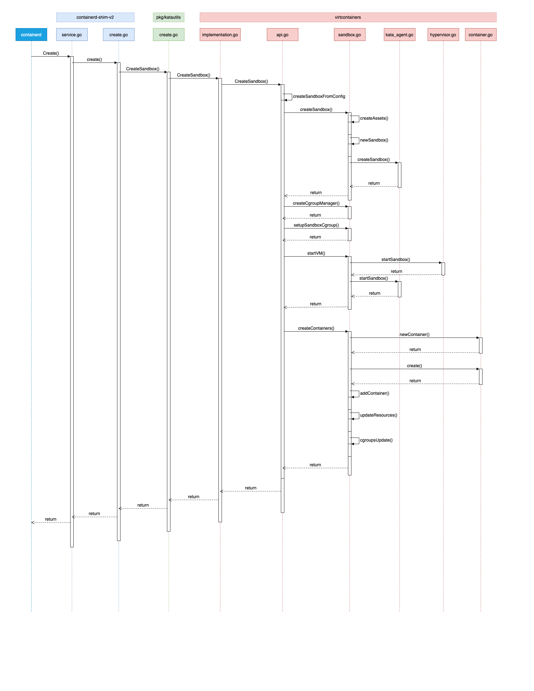

# Runtime 代码解析

runtime 为运行在宿主机上的、支持 shim v2 协议的进程。在这系列文章中，多数情况下可以将 runtime 、shimv2 视为同一内容。

## Runtime 概要

Runtime 大致架构如下图所示：


整个 Runtime ，其可执行程序为 `containerd-shim-kata-v2`，也即 shim 进程，这也是 Kata Containers 的入口点。Runtime 对上接受 containerd 的请求（通过 shimv2 “协议”），对 guest 来说，通过 guest 内的 agent 来控制 guest 内容器的创建、删除等管理。

Runtime 和 agent 之间的采用了 ttrpc 协议通信，这是一个使用了 protocol buffer 编解码方式的类似 gRPC 的通信方式。该协议由 containerd 创建，用于 containerd 和底层 runtime 之间的通信。在 Kata Containers 中， runtime 和 agent 也通过 ttrpc 通信。

## Packages 介绍

Runtime 代码在 src/runtime 下，主要由如下几个 package

### cli

这个包下主要定义了各个构建出来的二进制可执行文件的 main 函数，有如下几个：
- `containerd-shim-kata-v2`
- `kata-runtime`
- `kata-monitor`

### containerd-shim-v2

这个包是实现了 shim v2 协议的 ttrpc server 的入口，具体容器、sandbox 的操作，则使用了 pkg 和 virtcontainers 两个包下的实现。

Shim v2 实现文件入口在 `src/runtime/containerd-shim-v2/service.go` 中。这个文件定义了 service struct ，该结构实现了 shim v2 协议要求的接口（为方便阅读删除了部分属性）：

```golang
type service struct {
	// hypervisor pid, Since this shimv2 cannot get the container processes pid from VM,
	// thus for the returned values needed pid, just return the hypervisor's
	// pid directly.
	hpid uint32

	// shim's pid
	pid uint32

	sandbox    vc.VCSandbox
	containers map[string]*container
	config     *oci.RuntimeConfig
	events     chan interface{}
	monitor    chan error

	id string
}
```

在这个结构中，主要的是 `sandbox` 和 `containeres` 属性。 `sandbox` 指向一个 `vc.VCSandbox` 接口实例， `containers` 是一个容器列表，很多 shimv2 接口都是对容器的操作，都会使用到这个结构。`monitor` 用于监控 sandbox 是否在运行中。

Shimv2 要求的接口如下：

```golang
type Shim interface {
	shimapi.TaskService
	Cleanup(ctx context.Context) (*shimapi.DeleteResponse, error)
	StartShim(ctx context.Context, id, containerdBinary, containerdAddress string) (string, error)
}

type TaskService interface {
	State(ctx context.Context, req *StateRequest) (*StateResponse, error)
	Create(ctx context.Context, req *CreateTaskRequest) (*CreateTaskResponse, error)
	Start(ctx context.Context, req *StartRequest) (*StartResponse, error)
	Delete(ctx context.Context, req *DeleteRequest) (*DeleteResponse, error)
	Pids(ctx context.Context, req *PidsRequest) (*PidsResponse, error)
	Pause(ctx context.Context, req *PauseRequest) (*google_protobuf1.Empty, error)
	Resume(ctx context.Context, req *ResumeRequest) (*google_protobuf1.Empty, error)
	Checkpoint(ctx context.Context, req *CheckpointTaskRequest) (*google_protobuf1.Empty, error)
	Kill(ctx context.Context, req *KillRequest) (*google_protobuf1.Empty, error)
	Exec(ctx context.Context, req *ExecProcessRequest) (*google_protobuf1.Empty, error)
	ResizePty(ctx context.Context, req *ResizePtyRequest) (*google_protobuf1.Empty, error)
	CloseIO(ctx context.Context, req *CloseIORequest) (*google_protobuf1.Empty, error)
	Update(ctx context.Context, req *UpdateTaskRequest) (*google_protobuf1.Empty, error)
	Wait(ctx context.Context, req *WaitRequest) (*WaitResponse, error)
	Stats(ctx context.Context, req *StatsRequest) (*StatsResponse, error)
	Connect(ctx context.Context, req *ConnectRequest) (*ConnectResponse, error)
	Shutdown(ctx context.Context, req *ShutdownRequest) (*google_protobuf1.Empty, error)
}
```

可以看到 shimv2 接口实际上是没有“容器”类型资源的接口的，只是“Task”类型的资源，所以 ctr 命令也是使用了 `ctr container` 好 `ctr task` 两个子命令来分别处理容器和 task：容器是一组静态资源，只有真正启动（运行）后，才能成为 Task ，也就是进程。

`Cleanup` 会有清理 task（这时候 shimv2 进程可能因为意外退出了，所以不能通过 shimv2 的 ttrpc 链接来执行操作）

`StartShim` 用于启动一个 shimv2 进程。

#### shim v2 启动过程

shimv2 启动的时候，实际上是启动了两次 shim v2 进程。

containerd 会调用 [StartShim](https://github.com/kata-containers/kata-containers/blob/2.0.3/src/runtime/containerd-shim-v2/service.go#L173-L233) 函数启动 shimv2 进程。实际启动 shimv2 进程的方法 containerd 已经[封装好了](https://github.com/kata-containers/kata-containers/blob/2.0.3/src/runtime/vendor/github.com/containerd/containerd/runtime/v2/shim/shim.go#L132)，Kata Containers 只需要按照 containerd 包的规则实现指定的 New 方法以及 shimv2 要求的接口即可。

这个启动方法[大致如下](https://github.com/kata-containers/kata-containers/blob/2.0.3/src/runtime/vendor/github.com/containerd/containerd/runtime/v2/shim/shim.go#L143-L207)：

```golang
// src/runtime/vendor/github.com/containerd/containerd/runtime/v2/shim/shim.go
service, err := initFunc(ctx, idFlag, publisher)

switch action {
case "delete":
	response, err := service.Cleanup(ctx)
	// ...
case "start":
	address, err := service.StartShim(ctx, idFlag, containerdBinaryFlag, addressFlag)
	if err != nil {
		return err
	}
	if _, err := os.Stdout.WriteString(address); err != nil {
		return err
	}
	return nil
default:
	// ...
	client := NewShimClient(ctx, service, signals)
	return client.Serve()
}
```

我们可以看到， shimv2 进程可以接收 “3” 个参数：
- "start"：启动 shimv2 进程
- "delete"：删除容器
- "": 启动 shimv2 ttrpc service

启动一个 shimv2 进程，实际上 `containerd-shim-kata-v2` 是运行了两次，如下图所示：



第一次启动是由 containerd 发起，第一个参数是 start ，这时候启动参数包括：

- `-namespace`：容器的 namespace
- `-address`： containerd 服务的监听地址
- `-publish-binary`： containerd 发布事件的二进制程序路径。
- `-id`：容器ID

在 start 中，shimv2 会创建一个监听 ttrpc 的 socket 地址，然后在该进程中再启动一个 shimv2 进程。第二个 shimv2 进程启动时使用 golang 的 `exec.Start()` 系统函数，启动进程但是不等待进程结束。
第二个启动的shimv2进程也不带参数（但是带 commandline options，即 -- 开头的命令行选项），这对应上面代码中 `switch` 的 `default` 的处理分支，即：

```golang
client := NewShimClient(ctx, service, signals)
return client.Serve()
```

也就是说，第二个启动 shim v2 会长时间运行下去，作为 ttrpc server，提供 shimv2 的 API 。

ttrpc 监听地址是一个特殊类型的 unix socket，名为 abstract unix socket，用 `netstat --protocol unix` 查看的话，这类 socket 地址前面会有一个 `@` 符号。这个 socket 是在第一个 shimv2 打开的，文件描述符会传递给子进程，即第二个 shimv2 进程，在第二个 shimv2 进程中，会使用下面的方法来获取这个 socket 地址作为 ttrpc 的服务监听地址：

```golang
// src/runtime/vendor/github.com/containerd/containerd/runtime/v2/shim/shim_unix.go
func serveListener(path string) (net.Listener, error) {
	if path == "" {
		l, err = net.FileListener(os.NewFile(3, "socket"))
		path = "[inherited from parent]"
	} else {
		if len(path) > 106 {
			return nil, errors.Errorf("%q: unix socket path too long (> 106)", path)
		}
		l, err = net.Listen("unix", "\x00"+path)
	}
	return l, nil
}
```

在 containerd 的当前实现中，并没有通过命令行参数传递这个 socket 地址，所以 使用了 `os.NewFile(3, "socket")` 这种方式获取从父进程传递过来的文件描述符：

父进程（第一个 shimv2 进程）：
```golang
cmd, err := newCommand(ctx, containerdBinary, id, containerdAddress)
socket, err := cdshim.NewSocket(address)
f, err := socket.File()
cmd.ExtraFiles = append(cmd.ExtraFiles, f)
```

子进程（第二个 shimv2 进程）：
```golang
l, err = net.FileListener(os.NewFile(3, "socket"))
```

第一个 shimv2 进程，会将 ttrpc 监听地址写入到标准输出，返回给 containerd 使用。

**Note:** containerd 有一些 task 事件是通过 shimv2 进程调用 containerd 程序来发送给 containerd 的，而不是通过网络连接或者 API ，所以 shimv2 启动选项中有 `publish-binary` 。

#### CreateContainer

- containerd 通过 shimv2 的 Create() 接口创建 task（containerd-shim-v2/service.go）
- Create() 调用 create() 方法（containerd-shim-v2/create.go）
- 根据 containerType：
  - PodSandbox：创建 sandbox 容器，如果是 cri 的话，即 pause 容器。
    - katautils.CreateSandbox()（pkg/katautils/create.go）
      - VCImpl.CreateSandbox()（virtcontainers/implementation.go）
      	- CreateSandbox()（virtcontainers/api.go）
      		- createSandboxFromConfig()（virtcontainers/api.go）
      			- s := createSandbox()（virtcontainers/sandbox.go）
      			- s.createNetwork()（virtcontainers/sandbox.go）
      			- s.startVM()（virtcontainers/sandbox.go）
      			- s.createContainers()（virtcontainers/sandbox.go）
  - PodContainer：创建普通业务容器，即用户真正的用于工作的容器。
    - katautils.CreateContainer()（pkg/katautils/create.go）
      - sandbox.CreateContainer()（virtcontainers/sandbox.go）

更复杂的可以参考下面这个图，这个图显示的是创建 PodSandbox 时候的流程。由于是 sandbox 容器，因此虚拟机是在这个步骤中创建的。



其中下面这 `Sandbox` 结构体的这两个属性需要注意一下，即：

```golang
// virtcontainers/sandbox.go
type Sandbox struct {
	config *SandboxConfig
	containers map[string]*v
}

type SandboxConfig struct {
	// Containers describe the list of containers within a Sandbox.
	// This list can be empty and populated by adding containers
	// to the Sandbox a posteriori.
	//TODO: this should be a map to avoid duplicated containers
	Containers []ContainerConfig
}

// virtcontainers/container.go
type Container struct {
	config *ContainerConfig
}

type ContainerConfig struct {
}
```

`Sandbox` 结构体保存了两个关于容器的结构： `SandboxConfig` 和 `Container`（定义在 `container.go` 里）。这两个既要区分清楚，也不能忘记数据的同步，因为 SandboxConfig 里保存的 `ContainerConfig` 并非指针，而是一个复制对象，而  `Container` 保存的则是一个指针。

### virtcontainers

这里是 Kata Containers 中的核心实现代码，主要是通过对 hypervisor 和 guest 的管理，实现标准的容器操作接口。

### pkg

包括了一些基本的帮助函数。


### 到底 runtime 名字怎么写？

在 K8s 和 containerd 中，我们会看到很多用于设置 runtime 的地方，比如 `RuntimeClass` 、Pod 的 `runtimeClassName` 定义，以及 `ctr run --runtime io.containerd.run.kata.v2` 和 `crictl runp -r kata` ，里面都有参数指定运行时的名字。

runtime 的名字和可执行程序之间的名字是有一个对应关系的，这样 containerd 这样的高级 runtime 就能找到 shimv2 二进制并启动 shimv2 进程。

其解析过程大致如下：

- Pod 的 `runtimeClassName` 属性会查找同名的 `RuntimeClass` 资源
- 根据 该资源的 handler ，在 containerd 的配置文件查找相应的运行时（ [plugins.cri.containerd.runtimes.${HANDLER_NAME}] ）。

一般情况下 containerd 配置会像这样：

```
[plugins.cri.containerd.runtimes.kata]
  runtime_type = "io.containerd.kata.v2"
```

从上面不难看出另外两个结论：

- ctr 命令使用的是 containerd 配置文件中的 `runtime_type` 属性（ containerd 用）。
- crictl 和 K8s（实际也是 CRI 接口） 使用的是 containerd 配置中的 HANDLER_NAME（ CRI 用）。


默认情况下，containerd 会根据 `runtime_type` 按规则对应到具体的运行时的可执行文件名。比如 Kata Containers 运行时最终会转换为 containerd-shim-kata-v2 命令，该命令默认安装在 /usr/local/bin/containerd-shim-kata-v2 。

具体 containerd 的转换规则可以参考[这里](https://github.com/containerd/containerd/tree/master/runtime/v2#binary-naming)的说明。

